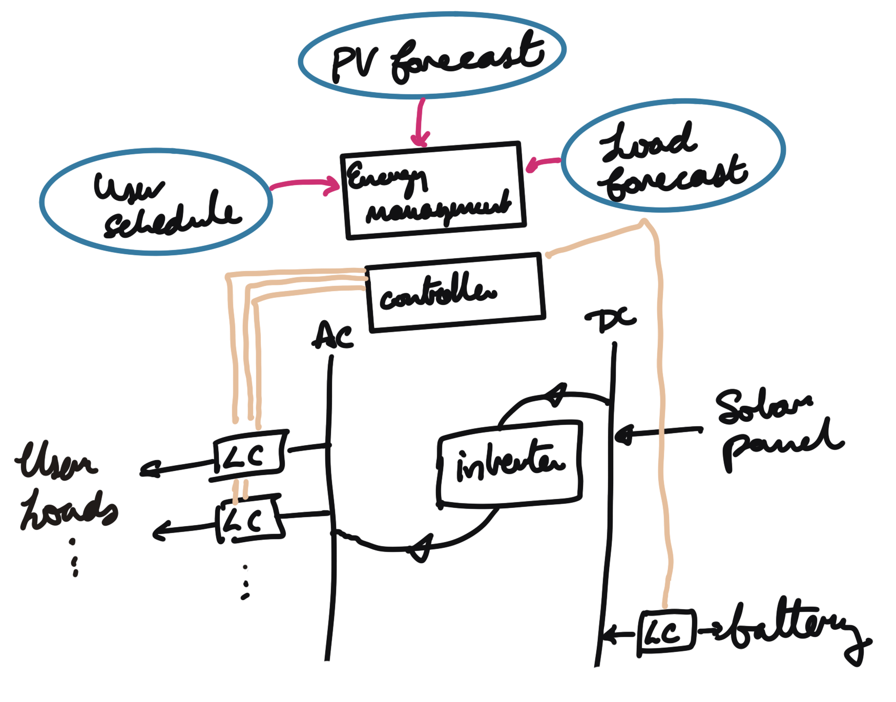
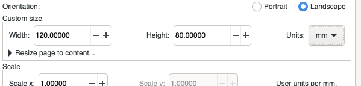
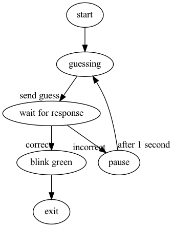
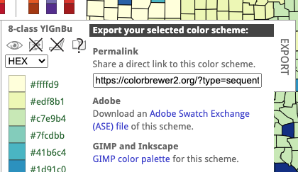
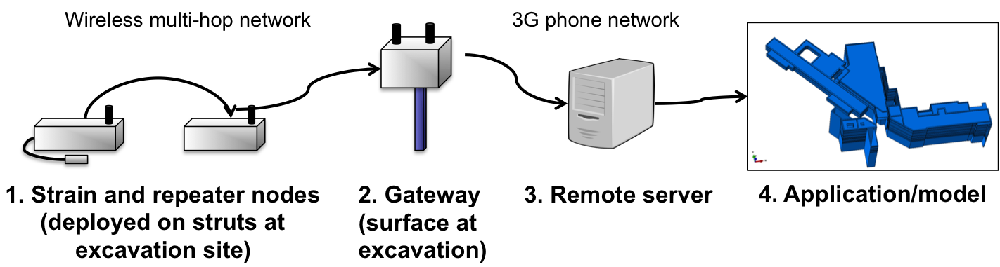
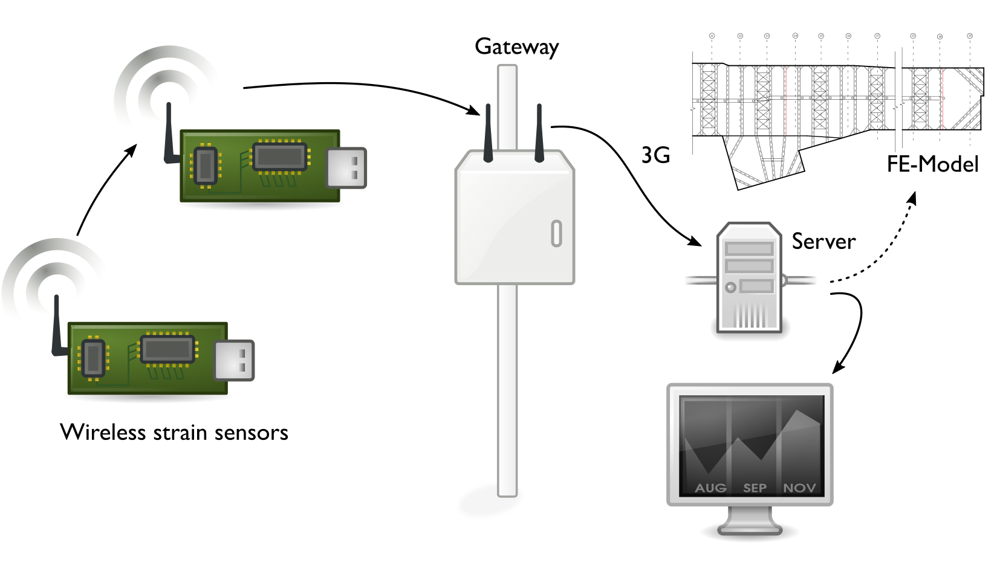

#+BLOG: jamesbrusey
#+POSTID: 432
#+ORG2BLOG:
#+DATE: [2022-06-20]
#+OPTIONS: toc:nil num:nil todo:nil pri:nil tags:nil ^:nil
#+CATEGORY: writing
#+TAGS: Science, LaTeX, Diagrams
#+DESCRIPTION:
#+TITLE: Drawing diagrams and figures for research articles and theses

Devising easy to understand, clear, concise diagrams for your research article can be a daunting task.
On the one hand, expressing your ideas graphically may not come naturally.
On the other hand, it can be difficult to get graphic editing tools to produce the look that you want.

However, diagrams are also an important part of doing great research.
When your readers first approach your article, the diagrams are likely to act as a gateway to the rest of the content.
A good diagram doesn't just take up space---it can bring the subject matter to life.
It can also add a lot of character to your work and provide a personal touch that is so often missing otherwise.
The care and attention to detail that you put into your diagrams will hugely impact how your paper is received.

Given the importance of this topic, I have put together some recommendations on producing diagrams based on my experiences with reviewing research papers and supervising doctoral students.
This text is currently in draft form---I still need to add in some more example images.
If you have any comments, I'd really like to hear from you!

* Start with a rough sketch
A good diagram conveys an idea or a set of ideas in a concise way. For this reason, the first sketch that you do may not work as a good explanation of the idea. Be prepared to throw away the first version (or so) and for this reason, it is much easier to sketch out by hand before you start. Once you have a workable sketch, you'll find it easier to lay out the text and graphics on the diagram in a neat way using a graphics package.

#+caption: A rough sketch involving different sorts of elements (a controller is different from a load forecast, which is different again from a solar panel) and different sorts of interconnections (such as, the connection between the load controller (LC) and the main controller versus the transmission of information from the PV forecast to the energy management system).
#+attr_html: :width 300px

* Size your canvas appropriately before laying out

If you use a package such as Inkscape, it will, by default, give you an A4 page to draw upon. This leads you to draw a large diagram that covers the whole page, which is then shrunk to, say, 3 or 3.5 cms to scale it to fit into a two column document (suitable for most conferences). However, you will thus end up with tiny text, large amounts of space between boxes, thin and spiderlike lines and arrows, and large amounts of padding within the boxes around any text.

To avoid this problem, start by sizing the diagram to fit to your column width. You should aim to avoid any resizing of the diagram when importing it. If you adjust the canvas size, it is useful to leave a small (say 1mm) space, around the outside of the figure since, even if the graphical elements are positioned only inside the edge of the paper, aliasing effects can cause them to flow slightly outside, and they will look cut off if they are right on the edge.

What will happen if you don't take this advice? You might still be able to use scaling to fit a diagram to your page. However the font sizes won't match up. One trick to get around this is to use a different font than is used in the main body of the text. For example, use Helvetica in the diagram and Times Roman in the body text. This way, the font size mismatch will be less obvious.

Careful use of the scale transform applied to the whole diagram can also be used to adjust an existing diagram to fit in your target space. Make sure you adjust horizontal and vertical proportionally. You may need to rectify font sizes slightly afterwards (they might be 9.1 pt instead of 9 pt, e.g.)

#+caption: In Inkscape, you can find the option to resize the canvas under =File= / =Document properties...= and select the =Page= tab.

* For line drawings, output vector graphics
When you drawing is shown on the final printed page, the available final resolution may be thousands of dots per inch (DPI).
For this reason, a pixel graphic that works well on the screen may look pixelated and ugly on the printed page.
Once you become aware of this issue, such eyesores stick out.
To avoid the problem, make sure you can output vector graphics from your drawing tool before you start.

There are a few cases where it is still a good idea to output raster images.
For example, if you have a scatter plot graph that contains many thousands of individual dots, then rendering this as a vector image can slow the PDF viewer down a lot when it shows your final page.
In this case, I recommend using a PNG (or raster image) instead.

If your tool doesn't support line drawings of the quality you desire, spend some time investigating some other tools.

* Selecting a suitable drawing tool
There are many excellent drawing tools are available.
All seem to have strengths and weaknesses.
The main point here is to not to accept the default, or at least, not to accept it without some probing.
Here are a few that I've found useful but there are plenty more and if you have other favourites, please let me know!
Note that I deliberately exclude non-free software here.
For example, Microsoft Powerpoint and Microsoft Visio are well regarded but if you lose access to the license, you will no longer be able to edit your image.

| Tool        | Strong at                                                           | Not so good for                                               |
|-------------+---------------------------------------------------------------------+---------------------------------------------------------------|
| Inkscape    | Basic line drawings, shadows                                        | Connected elements, generating from code, accuracy            |
| tikz        | Accuracy, relative positioning, generated from code                 | Quick sketches                                                |
| graphviz    | Drawing networks of connected items                                 | Specifying where to draw ovals or boxes or how to route lines |
| dia         | Electronics, data flow diagrams, UML, exporting to LaTeX (pgf) code | Precise diagrams                 |
| Google docs  | Including in a google slides presentation                           | Precise diagrams                                              |

* Use a consistent sizing of fonts and lines

Avoid having some lines thicker than others unless it was your intent to convey extra information this way. In this case, be careful that the reader understands that extra information in the way that you think she does. Try to avoid allowing lines to be too thin or thick (1 pt should generally be considered a minimum).

Avoid small font sizes: some conferences and journals explicitly request nothing smaller than 8pt in graphics.

Avoid overly large font sizes. Scaling of a small diagram can expand text - avoid this by turning off rescaling in LyX or LaTeX and by limiting the maximum font size to around 12 or less.

As a general rule, you should try to match the caption font size (typically 9pt).

* Type consistency
Aim to have a particular type of graphical element (such as an arrow, box or circle) having a consistent meaning across the whole diagram. For example, avoid using arrows in one place to indicate transfer of control and in another, transfer of information.
* Try to use standard diagrams
If you are representing data flows, use a data flow diagram (DFD). If you are representing class hierarchy, use a UML class diagram. If you can't find a diagram style that suits, you may need to make your own but consider borrowing strong elements from existing formats.
* Be careful with resizing
If you resize text, it can make a fundamental alteration to the font - squashing horizontally and stretching vertically or vice versa. This text will look slightly wrong (but you probably won't be able to say exactly why it's wrong unless you look closely).

A similar problem occurs with many other things (such as the widths of lines, which will be altered by squeezing or stretching).

The solution is to completely avoid resizing using the stretch tool. Resizing of boxes and lines can be achieved by using the "edit paths" tool. Text should be resized by changing the font size.

If you have existing text that has been stretched or squashed, the simplest fix is to cut and paste the text to a new text box. You'll probably be surprised how much it changes!

* Drawing arrows between shapes
The way that most computer programs (and most computer scientists) that draw diagrams is not, in my view, aesthetically pleasing. They tend to use the rule: draw from the centre of an edge to the centre of the target edge.

However, I (and many other people) prefer that you draw arrows aligned to a line going through the centroid (or centre of mass).

Furthermore, the eye appreciates curves rather than straight lines; so you could keep with centre edge but curve the line

But actually I think that this works poorly when there are many arrows and it is better to draw a curve centroid to centroid.

To construct this last one, you need to either use clipping (I think Inkscape might support this) or you align your arrow with a curve that is drawn centre to centre that starts out going right and ends going right. The control points need to be done by eye to make a line that you find appropriate.
   #+begin_src dot :file figures/state-diag.png :exports results
	digraph {
	start -> guessing
	blink [label="blink green"]
	blink -> exit
	wfr [label="wait for response"]
	guessing -> wfr [headlabel="send guess"]
	wfr -> pause [headlabel="incorrect"]
	pause -> guessing [taillabel="after 1 second"]
	wfr -> blink [headlabel="correct"]
	}
    #+end_src
#+caption: An example diagram using GraphViz (specifically, the =dot= program). Note that arrows meet the surface of the oval so that the line of the arrow points to the centre of the oval. Some further improvements to make here are to ensure that text does not crash into the lines or arrowheads.
    #+RESULTS:
    

* Sizing boxes with text

Generally speaking, vertical and horizontal padding between text and the edge of a box surrounding it should be (a) even above and below / left to right and (b) roughly the same between horizontal and vertical.

* Choose a good colour scheme

http://colorbrewer2.org/ provides a nice way to choose a colour scheme that is both pleasant and consistent.
It also helps with producing diagrams that might also work if they are printed on a black and white printer or are viewed by people who have impaired colour vision.

I must admit that I always found it a bit of a pain to carefully type in the hex codes for each individual item that I wanted to colour.
So I was especially pleased when I discovered the export option in colorbrewer.
Note that the resulting palette will be named something like `CB_qual_Paste1_5' and you need to restart Inkscape after moving the file into your palette directory to get it to load.

#+caption: Colorbrewer2.org also supports exporting a palette, which can be downloaded and inserted into the appropriate directory for Inkscape (see https://inkscape-manuals.readthedocs.io/en/latest/palette.html).

* Print out and review
Many small mistakes can be spotted by printing the graphic out in the correct size (i.e., the size that it will eventually be printed at) and examining carefully. There are several things to check for:
+ have boxes or lines become pixellated?
+ is the text readable (too small or large)?
+ is it well balanced
+ are there extraneous artefacts (e.g. small graphical elements that are not supposed to be there)
* Check for spelling errors
The print out and review stage is also a good time to make sure that the spelling is correct. Although Inkscape and many other graphical programs will check for errors, they can't spot substitutions such as "through" to "trough" or "perform" to "preform". The only way to be sure is to read through all the text carefully.
* Make your figure caption informative
Captions help the reader understand a diagram.
However, there seems to be a trend towards making captions short and rather cryptic.
For example, "System architecture" doesn't tell you anything.
Probably there are some boxes and arrows---but what do the boxes and arrows stand for?
Is a box a piece of software or a physical computer or a metaphorical entity that flows over multiple devices?
What do arrows really mean? Flow of information, perhaps? Direction of control?
Physical connection?
If colour is used, or some element is made larger or bolder, was this just a slip of the mouse or in important part of the information that was intended to be conveyed.
Thus a good figure caption can help to clarify those elements that are ambiguous.

A common idiom is to start a caption with a noun phrase that identifies the thing that you are looking at.
However, you shouldn't stop there.
Aim for about 3 or 4 lines of text but use more or less depending on how easily your diagram can be explained.

* A check-list for graphics
The following check-list should be used to ensure your graphics are of good quality:
1. Is the graphic sized correctly for the target column size (about 3.5 cm for double column, e.g.)?
2. Are fonts consistent and sized so that they are readable?
3. Is padding around text minimal (not wasting too much space)?
4. Is the colour scheme appropriate for the use?
5. Have you printed out and reviewed on paper?
6. Spell checked?
* Some examples
#+caption: In this original version of an architecture diagram, notice how the arrow heads are unclear. The blob on the right of the diagram is supposed to represent the finite element model of the structure (a subway terminal) but this also is unclear.

#+caption:In the revised architecture diagram, the wireless sensors are more clearly shown with antennae that actually look like antennae. Clipart from a free clipart website was used here. The finite element model is also more clearly portrayed. Unfortunately, there is an error in the clipart used for showing the computer screen---the month of October has been skipped.

# ./figures/sketch.png https://jamesbrusey.coventry.domains/wp-content/uploads/2022/09/sketch.png

# ./figures/canvas-sizing.png https://jamesbrusey.coventry.domains/wp-content/uploads/2022/09/canvas-sizing.png

# ./figures/arch-orig.png https://jamesbrusey.coventry.domains/wp-content/uploads/2022/09/arch-orig.png
# ./figures/arch-orig.png https://jamesbrusey.coventry.domains/wp-content/uploads/2022/09/arch-orig.png
# ./figures/arch-final.png https://jamesbrusey.coventry.domains/wp-content/uploads/2022/09/arch-final.png

# figures/state-diag.png https://jamesbrusey.coventry.domains/wp-content/uploads/2022/10/state-diag.png

# figures/colorbrewer-export.png https://jamesbrusey.coventry.domains/wp-content/uploads/2023/01/colorbrewer-export.png
